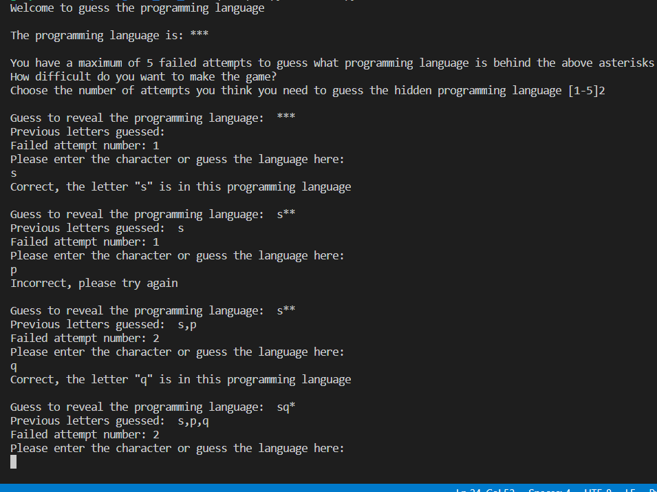

# Guess the Word 

Guess the Word is a Python terminal game, which runs in the Code Institute mock terminal on Heroku.

This game, guess the word, is based on programming languages.  Users have to guess what language is hidden behind asterisks.

 

Here is a link to my project: https://guess-the-language001.herokuapp.com/
 

## How to play
 
Guess the Word is a game similar to hangman but without the image of the hangman.  

In this version, the player will choose how difficult the level will be by entering how many attempts he or she requires.

The player will be able to see the length of the language but will be marked out with asterisks.

If the player enters a correct character or symbol, the asterisk will disappear where that characte or symbol is.

There will also be a message displaying that the player got it correct and will show what letters or characters have been already guessed.

If the player gets the language wrong a message will be displayed saying that its incorrect.  Also there will be a display message indocated how many failed attempts have been made.

If the player thinks he/she knows the language they can simply type the word. 

 

## Features
 

### Exisiting Features
 
There is a list of languages in the programme and one language word is randomly assigned for the player to guess.

The player cannot see what languages are contained in the list, however, the player will is able to see the length of the word by the number of asterisks.

 
 

## Testing
 

I manually tested this project by doing the following:

<ul> Passed the code through a PEP8 linter and has minor issues relating to lines too long mostly</ul>
<ul>Given invalid inputs where the user is asked to enter number of attempts</ul>
<ul>Tested in my local terminal and the Code Institute Heroku terminal without any problems</ul>
 

## Bugs
 

### Solved Bugs
 

<ul>When I wrote the project, I was getting index errors, variables not definied and using quotations too many in one string</ul>

## Remaining Bugs
 
<ul> No bugs remaining</ul>
 

## Validator Testing
 

<ul>PEP8</ul>
    <ul>52 errors were returned from PEP8online.com</ul>
These 52 errors consisted of line too long, missing whitespace, too many black rows, block comment should start with '#'.  These errors were reduce to 22 errors. The 22 remaining errors can be broken down into 20 line too long and 2 missing whitespace. When I tried to but a space in the validator indicates it creates an error when i run the code in the gitpod terminal, therefore that error can be ignored. In relation to the erros for line too long, when i break the line up and run it in the terminal in gitpod I get an error back, therefore those erros can be ignored. 
 

## Deployment
 
This project was deployed using Code Institute's mock terminal for Heroku.
 
<ul>Steps for deployment

<ul>Clone repository</ul>
<ul>Create a new Heroku app</ul>
<ul>Add Var Config using PORT as the Key and 8000 as the Value</ul>
<ul>Set the buildbacks to Python and NodeJS in that order</ul>
<ul>Link the Heroku app to the repository</ul>
<ul>Click on Deploy manually</ul>
</ul>
 

## Credits
 

<ul>Code Institute for the development terminal</ul>
<ul>w3schools.com</ul>
<ul>https://www.geeksforgeeks.org/number-guessing-game-in-python/</ul>
<ul>Youtube.com
<ul>https://www.youtube.com/watch?v=m4nEnsavl6w&t=142s</ul></ul>